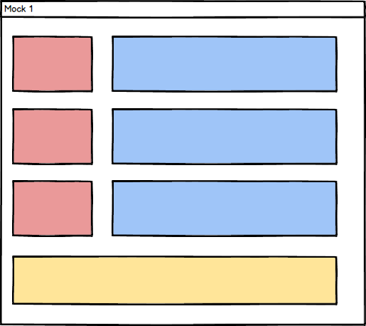

## Learning Goals

After this unit you will be able to...

- Understand what CSS Layout techniques are and what you can do with them
- Know the difference between some of the most important layout techniques
- Understand the basics of Flexbox, Grid, Floats and Relative Display techniques

## Introduction to CSS Positioning

In previous lessons we've seen how to create basic HTML structures; but so far we've only created layouts that follow a linear order. In this lesson we'll see an introduction to how we can create more complex screens and designs using CSS in order to change our layout.

The most important thing to understand about CSS layout is that it's not just about boxes and margins — it's all about positioning elements within those boxes.

CSS page layout techniques let us change where an element is positioned inside a design, relative to some factors like its parent element, the others around it, or even the browser window. There are several techniques we can use for this; in no particular order:

- Normal flow
- Display property
- Flexbox
- Grid
- Positioning (absolute & relative)
- Floats
- Table layout
- Multiple column layout

In this lesson we'll see an introduction to each one of these possibilites. In future lessons we'll dive in deeper to some of the most commonly used ones.

## Normal flow

The normal flow is the order in which elements appear on the page when we don't do anything special. For example, in a simple HTML template like the following:

```html
<h2>This is a header</h2>

<p>This is a paragraph</p>

<ul>
  <li>This is a list element</li>
</ul>
```

All the included elements will appear one after the other. As we've previously seen, some elements like `<div>` or `<p>` are considered "block" elements, and will fit the whole width of the browser screen. Others, like `<span>`, are "inline" elements and won't have a predetermined size.

When we use any of the CSS layout techniques we will see in this lesson, we can change the normal flow of the elements inside a document.

## The display property

The `display` property is one of our main tools when it comes to creating complex layouts and designs with HTML & CSS. This property allows us to modify the way elements appear on screen.

Every HTML element has a default `display` property. For example, "block" elements have a default `display: block` property. We can change this with CSS, effectively turning a block element into an inline one or vice versa.

However this is not the only use of the `display` property. Two of the most powerful tools for creating complex CSS layouts, `flexbox` and `grid`, are actually `display` options. Let's talk a bit more about them.

### Flexbox

The `flexbox` module allows us to define our page's content by giving each element its own size and placing them within a container. It's the best tool to position elements in one dimension, be it a column or a row.

Using flexbox is very simple. We just need to apply the CSS `display: flex` to our parent element, effectively making all its child elements flex items.

When we're using `flex`, we can apply special properties both to the parent element and to its childs. Among other things, when using this tool we'll be able to change the items' alignment, their relative size, their order or their position.

In [this link](https://codepen.io/enxaneta/full/adLPwv/) you can see in a very visual way how the different `flex` properties affect the elements it's applied to.

We'll dive deeper into the Flexbox Module in the following lessons.

### What is the CSS Grid Layout Module?

The CSS Grid Layout module is a new feature in CSS3 that allows us to divide our page into rows and columns. This means that we can create layouts designed for two dimensions, giving us a higher degree of control than Flexbox.

This doesn't mean that one is better than the other, however. Both `display` properties have their uses, and in most cases you'll need to use both in different parts of a project.

In order to use the Grid Module, you just need to set the `display` property of a container to "grid". Using this tool, we can define the number of columns and rows we want our design to have, and all the child elements will be automatically placed within them.

For example, if we had the following code:

```css
.parent {
  display: grid;
  grid-template-columns: 1fr 1fr 1fr 1fr;
  grid-template-rows: 100px 100px;
  grid-gap: 10px;
}
```

We're defining two rows with four equally sized columns each. Then, with the following HTML:

```html
<div class="parent">
  <div class="box1">One</div>
  <div class="box2">Two</div>
  <div class="box3">Three</div>
  <div class="box4">Four</div>
  <div class="box5">Five</div>
  <div class="box6">Six</div>
  <div class="box7">Seven</div>
  <div class="box8">Eight</div>
</div>
```

[This will be the result](https://codepen.io/alexrod94/pen/poWXmoy).

Again, the Grid property allows us to create very complex layouts and there's much more to it. However, we'll explore it in more detail in future lessons.

## Floats

Float is one of the oldest ways of changing a document's layout. With the `float` CSS property, you can move an element to the left or right side of the screen and remove it from the normal HTML flow. The rest of the elements will float around it, hence its name.

There are only four `float` values:

- `left`: Moves the element to the left.
- `right`: Moves the element to the right.
- `none`: Returns the element to the normal HTML flow. This is the default value.
- `inherits`: The element inherits its float property from its parent.

In the following example, we'll use `float` in order to place a box on the right side of the screen and have some text "floating" around it. This is one of its most common uses today:

```css
.box {
  float: right;
  width: 125px;
  height: 125px;
  margin-left: 20px;
  background: lightgreen;
}
```

```html
<h2>Float example</h2>

<div class="box">Floating box</div>

<p>
  Lorem ipsum dolor sit amet, consectetur adipiscing elit. Nulla luctus aliquam
  dolor, eu lacinia lorem placerat vulputate. Duis felis orci, pulvinar id metus
  ut, rutrum luctus orci. Cras porttitor imperdiet nunc, at ultricies tellus
  laoreet sit amet. Sed auctor cursus massa at porta. Integer ligula ipsum,
  tristique sit amet orci vel, viverra egestas ligula. Curabitur vehicula tellus
  neque, ac ornare ex malesuada et. In vitae convallis lacus. Aliquam erat
  volutpat. Suspendisse ac imperdiet turpis. Aenean finibus sollicitudin eros
  pharetra congue. Duis ornare egestas augue ut luctus. Proin blandit quam nec
  lacus varius commodo et a urna. Ut id ornare felis, eget fermentum sapien.
</p>
```

Again, you can see the results [in this link](https://codepen.io/alexrod94/pen/rNGEgWz).

## Positioning techniques

We've already seen how to use the `position` property to alter a document's layout in a previous lesson. However, it's important to keep in mind that this is one of the most useful techniques to alter the normal flow of a layout.

## Other techniques

In this lesson we've seen some of the most commonly used ways to design a complex layout using CSS. However, throughout the history of web development there have been other methods of creating layouts that have gone out of favor nowadays.

We won't dive deeper into them; but here are two other options you might see in your web development career:

- Table layouts.
- Columns layouts.

Both of them are rarely used today and you will probably only encounter them when working with legacy technology or maintaining pre existing code.

## Exercise

In order to practice what you've learned today, let's do an exercise. You have to recreate the following layout using any of the techniques you've learned today, whether it's floats, positioning, flexbox or grid:


