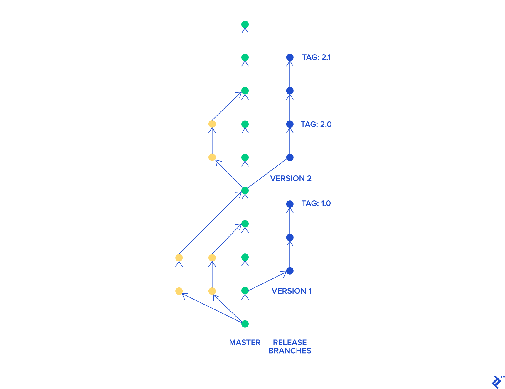

## Learning Goals

After this lesson you'll know:

- What's the importance of branching methodologies.
- What Gitflow was and how it was used.
- What is trunk based development and how to use it.

## Introduction to branching methodologies

Working in large scale projects with different team members is never easy. For that reason, different approaches and tools have appeared throughout the years.

In order to develop high quality software, we need to be able to track all changes and reverse them if necessary. Version control systems fill that role by tracking project history and helping to merge changes made by multiple people. They greatly speed up work and give us the ability to find bugs more easily.

Moreover, working in distributed teams is possible mainly thanks to these tools. They enable several people to work on different parts of a project at the same time and later join their results into a single product. Nowadays the trunk branching model that we can use with Git technology is the most common way of handling complex projects. However, this hasn't always been the case.

At the end of the day, Git is merely a tool that we can use in very different ways. In recent times there has been a contest between two different approaches: GitFlow and trunk based development. In this lesson we'll take a look at both of them.

## What is Gitflow?

Giflow is an alternative Git branching model that involves the use of feature branches and multiple primary branches. Compared to the more modern trunk-based development, Giflow has numerous, longer-lived branches and larger commits.

Under this model, developers create a feature branch and delay merging it to the main trunk branch until the feature is complete. These long-lived feature branches require more collaboration to merge and have a higher risk of deviating from the trunk branch. They can also introduce conflicting updates. This is one of the main reasons why this branching methodology is out of favor nowadays.

Gitflow can be used for projects that have a scheduled release cycle and for the DevOps best practice of continuous delivery. This workflow doesn’t add any new concepts or commands beyond what’s required for the Feature Branch Workflow.

Instead, it assigns very specific roles to different branches and defines how and when they should interact. In addition to feature branches, it uses individual branches for preparing, maintaining, and recording releases. Of course, you also get to leverage all the benefits of the Feature Branch Workflow: pull requests, isolated experiments, and more efficient collaboration.

In the GitFlow workflow, development teams work with two different main branches at all times. The `master` branch stores the official release history, and the `develop` branch serves as an integration branch for features.

This is how this branching system might look like:

### Feature branches & releases

Besides these two main branches, developers create a new feature branchfor every new functionality that they have to create. All these feature branches use `develop` as their parent. Once the feature is completed, it merges right back into `develop`.

Once enough feature branches have been integrated into `develop`, a `release` branch is created. This one is used to review all the code up to this point; and it can't include any new features.

Finally, once the `release` branch is reviewed and all appropriate changes are made, it merges back with `develop` and `master`, starting a completely new cycle.

### Using GitFlow today

One of the advantages of Git flow is strict control. Only authorized developers can approve changes after looking at them closely. It ensures code quality and helps eliminate bugs early.

However, you need to remember that it can also be a huge disadvantage. It creates a funnel slowing down software development. When speed is a primary concern, then it might be a serious problem. Features developed separately can create long-living branches that might be hard to combine with the main project.

What’s more, pull requests focus code review solely on new code. Instead of looking at code as a whole and working to improve it as such, they check only newly introduced changes. In some cases, they might lead to premature optimization since it’s always possible to implement something to perform faster.

Moreover, pull requests might lead to extensive micromanagement, where the lead developer literally manages every single line of code. If you have experienced developers you can trust, they can handle it, but you might be wasting their time and skills. It can also severely de-motivate developers.

GitFlow can still be of used in different situations, like when working on a team with a large number of junior developers; but in recent years its popularity has declined in favor of trunk - based development workflows.

## What is trunk - based development?

In the trunk-based development model, all developers work on a single branch with open access to it. Often it’s simply the `master` branch. They commit code to it and run it.

In some cases, they create short-lived feature branches. Once code on their branch compiles and passess all tests, they merge it straight to `master`. This ensures that development is truly continuous and prevents developers from creating merge conflicts that are difficult to resolve.

Trunk based development is one of the most commonly used approaches nowadays. It allows team members to work more independently from each other, thus allowing for more speed.

However, this Git approach is better used when working with more experienced developers. Otherwise, code quality could get worse.

Here's a quick look at how this branching method might look like:

## Which development style is better?

As we've already mentioned, both approaches to collaborative coding can work and have their uses. Depending on the kind of project you're working on, and the needs of your team, you'll be better served by one of them.

In [this article](https://www.devbridge.com/articles/branching-strategies-git-flow-vs-trunk-based-development/) you can take a more detailed look at some of the most important advantages and disadvantages of both models.

## Lesson summary

In this lesson, we've learned what branching methodologies are and why it's important to use them for bigger projects or when working with a team.

We've also taken a quick look at two of the most commonly used methodologies today: GitFlow & Trunk - Based Development. We've discussed which are some of their advantages and disadvantages, and when you might want to use one or the other.

## Further resources

- [This video](https://www.youtube.com/watch?v=U_IFGpJDbeU) explains in more detail what are the most common branching strategies used today.
- [This video](https://www.youtube.com/watch?v=1SXpE08hvGs) teaches you the basics of the GitFlow workflow in a very visual way.
- In [this website](https://trunkbaseddevelopment.com/) you can find much more information on what trunk based development is, how to use it and different tips and tricks on how to master it.
